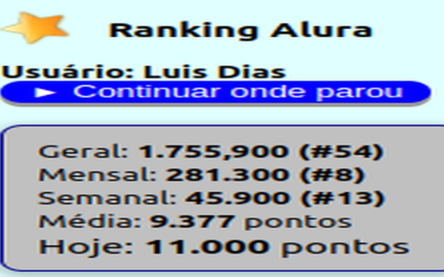

# Alura Rank

Visualiza seu ranking na Alura Cursos

## Pontuação cursos Alura

Fonte: https://cursos.alura.com.br/

## Descrição

+ Para você que é uma pessoa competitiva e /ou gosta de acompanhar seu progresso nos estudos
+ Você poderá ver como sua posição Geral, Mensal e Semanal, além de ver seus pontos do dia
+ Clicando sobre Geral, Mensal e Semanal você irá para a página com o primeiro colocado
+ Clicando sobre os valores ao lado de Geral, Mensal e Semanal você irá para a página com a sua colocação
+ Clicando sobre o Título você irá para o login/dashboard do curso Alura ou seu para o perfil caso esteja logado
+ Não perca seu objetivo e mantenha o foco
+ Seja sua melhor versão
+ Bons estudos

+ **Notas:** 
1. Está extensão não foi produzida pela Alura Cursos. 
2. Sou apenas um entusiasta e um aluno dedicado.
3. Nenhum dado é coletado
4. Você tem que está logado na Alura Cursos

## Repositório

Github: https://github.com/ocontrolador/aluraRank.git

## Extensão Chrome

[ Alura Rank](https://chromewebstore.google.com/detail/alura-rank/kjeinnlomeabhpphifhofhihapfkpcip)

## Licença

Este projeto está licenciado sob a Licença MIT
